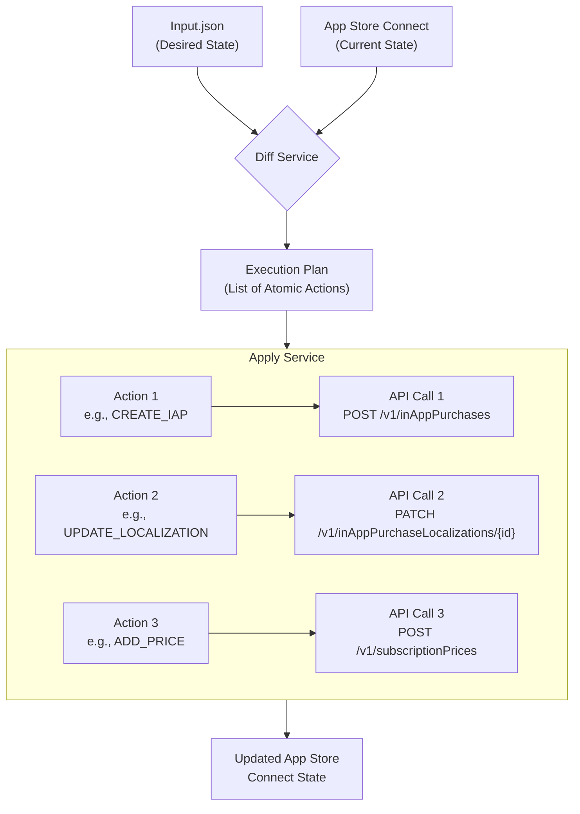

# Diff Service Implementation Plan

This document outlines the strategy for implementing the `diff` and `apply` functionality for managing App Store Connect in-app purchases and subscriptions.

## The Problem

A simple, shallow comparison of the current and desired states (e.g., using `JSON.stringify`) is insufficient. It can tell us _that_ an object has changed, but not _what_ has changed within it. To interact with the App Store Connect API, we need a granular list of changes to translate into specific API calls (e.g., updating a single localization or changing a price for one territory).

## The Solution: A Detailed Execution Plan

We will implement a sophisticated diffing engine that recursively compares the current and desired state trees. This engine will not just identify changed objects, but will produce a flat list of **atomic actions** that represent the precise operations needed to transition the current state to the desired state.

This approach gives us a clear, testable, and maintainable separation between figuring out _what_ to do (the diff service) and _how_ to do it (the apply service).

### Core Components

1.  **Atomic Actions**: We will define a set of specific, granular action types that represent every possible change (e.g., `CREATE_IN_APP_PURCHASE`, `UPDATE_SUBSCRIPTION_LOCALIZATION`, `DELETE_PRICE`). These will be defined in `src/models/plan.ts`.

2.  **Recursive Diffing (`diff-service.ts`)**: A series of diffing functions will "walk" the current and desired state trees. They will compare corresponding items using unique keys (like `productId` or `referenceName`) and generate a flat list of these atomic actions for any discrepancies found.

3.  **Execution Engine (`apply.ts`)**: The `apply` command will become an execution engine. It will iterate through the generated list of actions and make the corresponding App Store Connect API call for each one.

### Workflow Diagram

